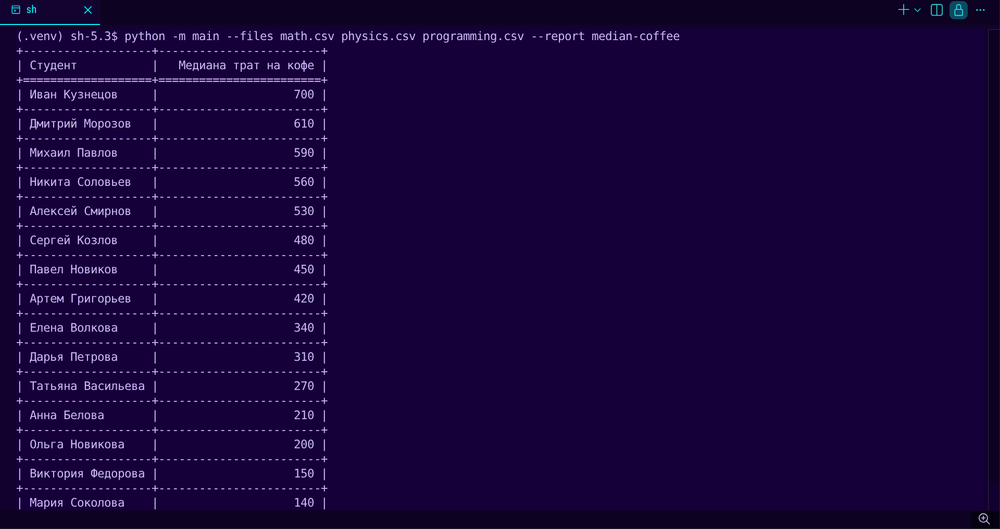
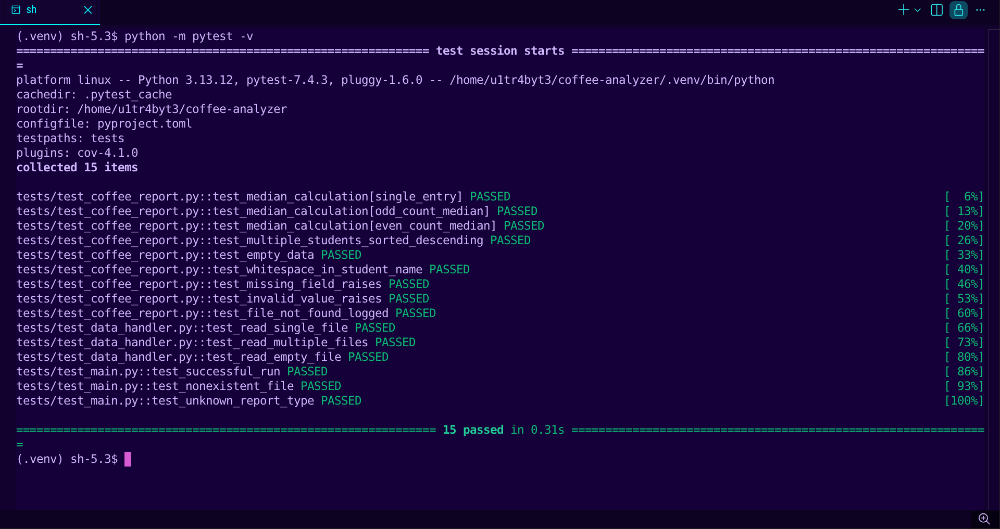
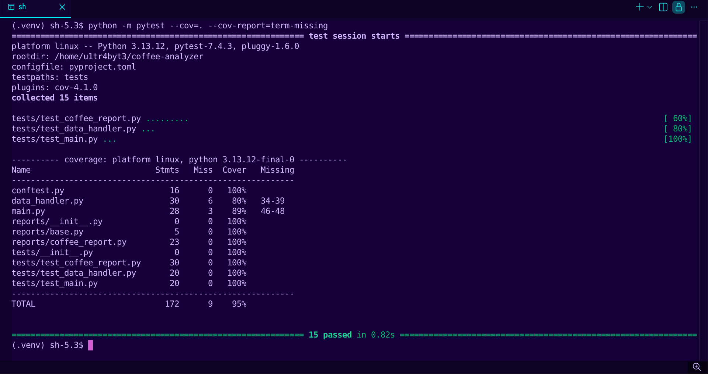
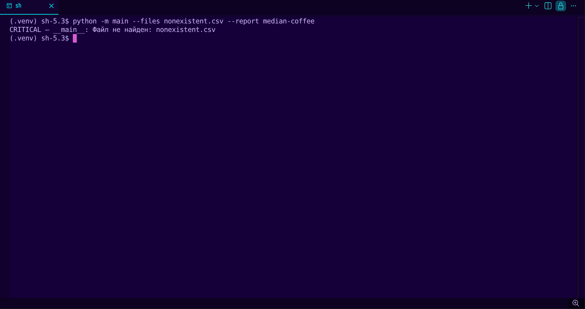
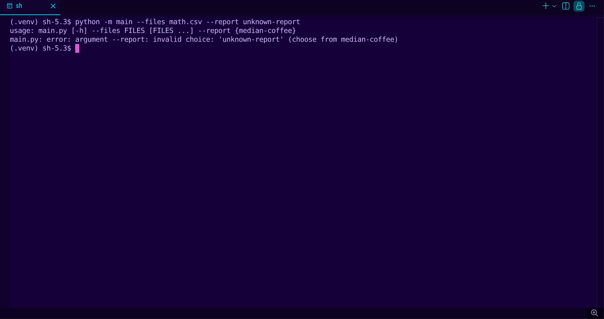

# Анализатор потребления кофе

Консольное приложение для анализа данных о подготовке студентов к экзаменам из CSV-файлов.

## Установка

```bash
pip install -r requirements.txt
```

## Использование

```bash
python -m main --files math.csv physics.csv programming.csv --report median-coffee
```

### Параметры:
- `--files` — пути к CSV-файлам с данными (можно передать несколько)
- `--report` — тип отчёта (`median-coffee`)

## Обработка ошибок

Приложение корректно обрабатывает ошибки и выводит сообщения в лог:

```bash
# Несуществующий файл
python -m main --files nonexistent.csv --report median-coffee
# CRITICAL — data_handler: Файл не найден: nonexistent.csv

# Неизвестный тип отчёта
python -m main --files math.csv --report unknown-report
# error: argument --report: invalid choice: 'unknown-report' (choose from median-coffee)
```

## Формат данных

CSV-файлы должны содержать колонки: `student`, `date`, `coffee_spent`, `sleep_hours`, `study_hours`, `mood`, `exam`

## Примеры работы

### Основной функционал


### Тестирование


### Покрытие тестами


### Обработка ошибок


### Валидация типа отчёта


## Линтер и форматирование

```bash
python -m ruff check .   # проверка кода
python -m ruff format .  # форматирование
```

## Запуск тестов

```bash
pytest
pytest --cov=. --cov-report=term-missing
```

## Архитектура

Новые типы отчётов добавляются в `reports/`, регистрируются в словаре `REPORTS` в `main.py` — без изменения остальной логики.
